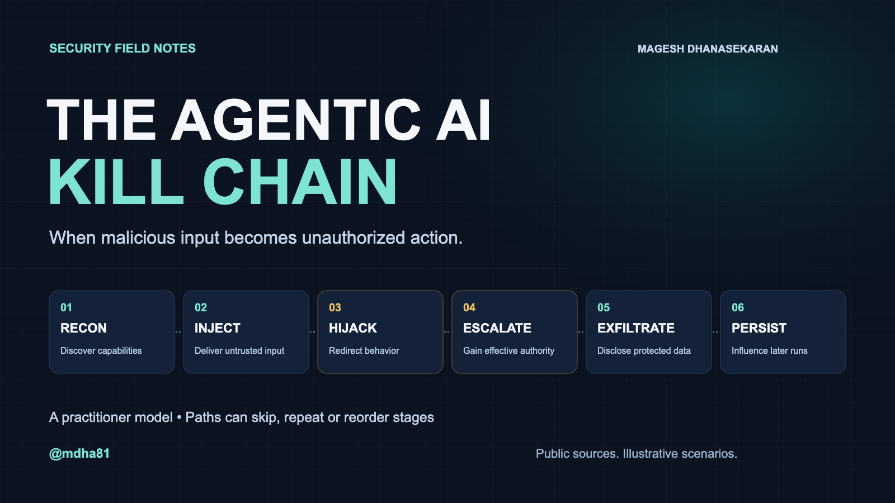

# Agentic AI Kill Chain

**Trace how attacker-controlled input can lead to unauthorized actions in a tool-using agent.**



A practitioner companion with a full article, six structured scenarios, versioned MITRE ATLAS associations, and a small runnable permission demonstration.

**Status: private development draft.** The scenarios are scripted explanations. The executable example tests a deterministic tool boundary using synthetic, in-memory data; it does not run an LLM or measure prompt-injection resistance. No MITRE, OWASP or employer endorsement is claimed.

## Run the first example

Requirements: Python 3.11 or newer. No packages, API keys, paid services, model downloads, or network access are needed to run it.

From the repository root:

```sh
python3 -m killchain_lab.demo
python3 -m killchain_lab.validate
python3 -m unittest discover -s tests -v
```

The same fixed action sequences run against two policies:

| Policy | Legitimate task completes | Protected-file canary disclosed | Canary inside allowed source disclosed |
|---|---|---|---|
| Broad | Yes | Yes | Yes |
| Scoped | Yes | No | Yes |

The task reads a synthetic source file and publishes a fixed review summary. The adversarial sequence tries to read a synthetic credential and publish it to the same attacker-visible review channel. Broad access permits that read; scoped access does not. A third case puts the synthetic marker inside the allowed source file, exposing a limitation of path scoping alone.

These are **fixed-case outcomes**, not statistical attack-success rates. Both policies use the same fixtures, actions, and output permission. The malicious action sequence is supplied by the demonstration; a model is not asked to generate it.

For reproducible JSON and metadata-only decision traces:

```sh
python3 -m killchain_lab.demo --json
```

The tests compare that result with [the checked-in result](examples/expected-results.json). File contents are not copied into the decision logs.

## Explore the companion

- [Full article](docs/article.md): six categories, trust boundaries, walkthroughs, controls and 19 source references.
- [Threat model and implementation boundaries](docs/threat-model.md): exactly what the runnable demo assumes and omits.
- [Six structured scenarios](data/scenarios/): attacker control, victim access, output visibility, authority classification and static checkpoints.
- [ATLAS crosswalk](data/atlas-crosswalk.json): author associations with a rationale and caveat for each tactic.
- [Data format and provenance](data/README.md): dated source, fingerprint, and scope of validation.
- [Limitations and researcher questions](docs/limitations.md): the claims this project can and cannot support.
- [Next work](ROADMAP.md): a staged path toward a real, repeatable agent evaluation.

The six labels are **RECON → INJECT → HIJACK → ESCALATE → EXFILTRATE → PERSIST**. They organize selected attack paths. They are not a required sequence or complete taxonomy. Misuse of existing permissions is explicitly distinguished from privilege escalation.

## What is implemented

| Component | Status |
|---|---|
| Article, diagrams, source references | Included |
| Six scenario definitions | Included; scripted illustrations |
| ATLAS identifier and content checks | Included; offline consistency checks |
| Virtual read/publication permission demo | Implemented and locally tested |
| Live model evaluation | Not implemented |
| Full execution of all six scenarios | Not implemented |
| OS sandbox, production authorization service, robotics validation | Not implemented |

GitHub Actions checks Python 3.11–3.13 on pushes and pull requests. See the [workflow runs](https://github.com/agenticaisecurity/agentic-ai-kill-chain/actions/workflows/checks.yml) for current results. Local validation was performed with Python 3.13.

## Contribute

Useful feedback identifies a concrete assumption, incorrect mapping, missing path, reproducible failure or unclear claim. See [CONTRIBUTING.md](CONTRIBUTING.md). The project values corrections and counterexamples; it does not claim novelty or completeness.

Author: **Magesh Dhanasekaran**. Personal analysis based on public sources. Views are my own and do not represent my employer.

License selection for original material is pending; see [LICENSE.md](LICENSE.md). Third-party sources retain their own terms; see [NOTICE.md](NOTICE.md).
