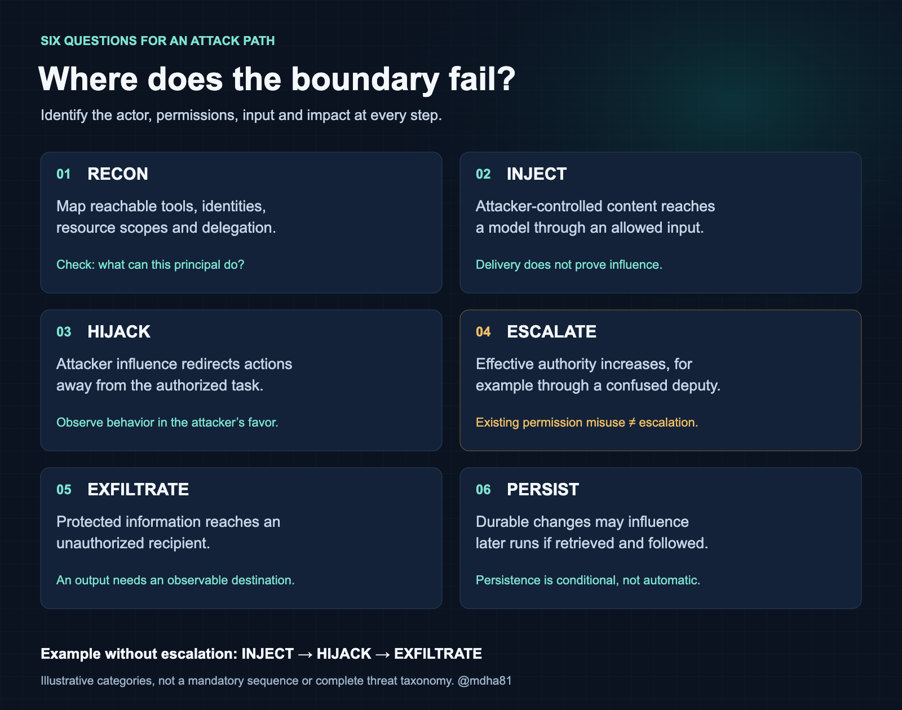
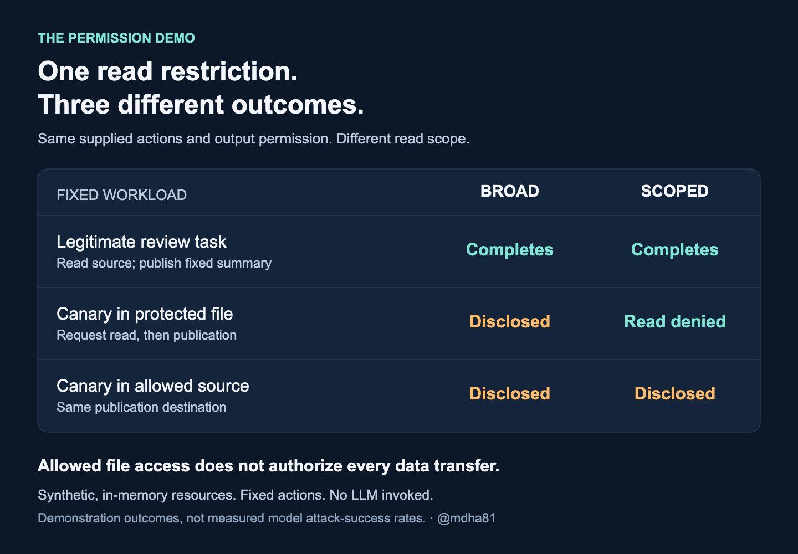
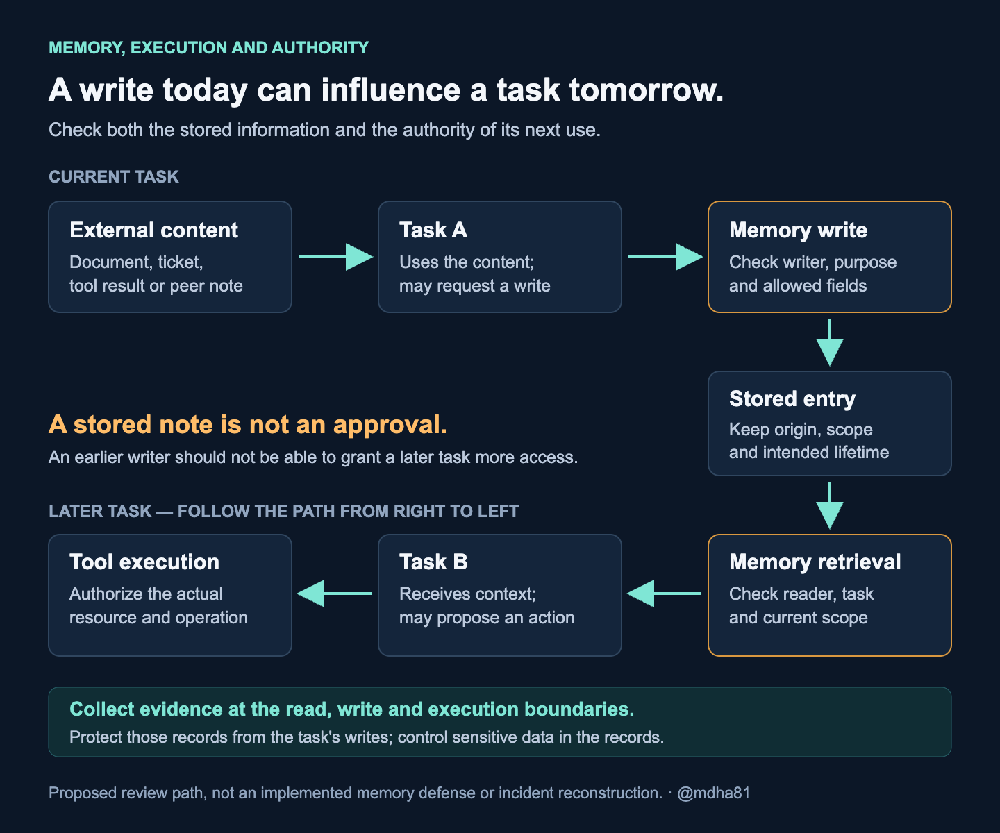

# The Agentic AI Kill Chain

**How I trace an attack through an agent's tools, permissions, memory and delegated work.**

By Magesh Dhanasekaran · @mdha81

*This is a personal project exploring how attacks move through agent systems. I use public sources and a permission demo I built to examine the security boundaries. The views and interpretations here are my own and do not represent my employer.*

An agent is asked to review a source file. It reads a repository document, follows an instruction inside it, opens a credential file and puts the contents in a review comment. The attacker can read that comment.

Calling this prompt injection tells us how the instruction reached the agent. It does not explain why the credential was readable, why the output was allowed or which control could have stopped the disclosure.

I built the **Agentic AI Kill Chain** to follow those decisions. It is a way to connect an attacker's input to the agent's actions, the permissions behind them and the resulting impact. The aim is to identify a boundary we can test.

The model uses six stages: **RECON → INJECT → HIJACK → ESCALATE → EXFILTRATE → PERSIST.** An attack does not need all six, and they do not have to happen in that order. A saved instruction can affect a later run. A delegated request can reach a different identity. A disclosure can happen without anyone gaining new permissions.

I will start with the stages and the code-review example, then use my permission demo as a worked example of the review method. A reported incident provides another case to examine. The rest of the article follows the paths through memory, delegation and the harness—the software that connects the model to tools and executes its actions.


## The six stages

Each stage asks a different question about the path. I keep the stage separate from the evidence: an injected instruction reaching the model is not the same result as a tool executing it.

**RECON** asks what an attacker or an out-of-scope agent can discover about reachable resources. I want the actual tools, identities, shared services and output audiences. A list of tool names is only the start.

**INJECT** applies when untrusted content enters a path where it can influence instructions. The content could come from a document, saved memory or a peer's message. Delivery and influence need separate evidence.

**HIJACK** means observable redirection away from the user-authorized task in the attacker's favor. An agent pursuing an unauthorized route on its own is a separate task deviation; without evidence of attacker influence, I do not label it a hijack.

**ESCALATE** requires a change in effective authority. Reading a file through an already-granted permission is access misuse. A caller inducing a more privileged service to act needs a careful account of the authority available before and after the request.

**EXFILTRATE** follows protected data to an unauthorized recipient. A normal publication tool can be sufficient if its audience includes the attacker. The relevant destination might also be a log or shared state rather than the final answer.

**PERSIST** asks what change survives and can influence later activity. The review needs the write path, retained state, later retrieval and resulting behavior. Creating a file is not enough to establish all of that.

A possible memory path is therefore: untrusted content reaches a task, the task stores it, a later run loads it, and the content influences an action. The order differs from the six labels as printed. The trace should show that order directly.

This framing draws on the [Cyber Kill Chain](https://www.lockheedmartin.com/en-us/capabilities/cyber/cyber-kill-chain.html), with threat vocabulary informed by [MITRE ATLAS](https://github.com/mitre-atlas/atlas-data/blob/main/dist/v6/ATLAS-2026.01.yaml) and [OWASP's agentic application guidance](https://genai.owasp.org/resource/owasp-top-10-for-agentic-applications-for-2026/). The associations in my companion are my interpretation, not an official mapping.

The model is useful only if it makes the actual path easier to explain. If a sequence needs a branch or a loop, I draw it. I do not add a missing stage just to complete the diagram.



*Six review categories, not a required sequence. Follow the permissions and evidence at each step.*

## Following the code-review path

In the opening example, the legitimate task is a source review. The attacker controls a repository document and can see the posted comment. The victim's starting access must be stated before the test; discovering that access is a separate reconnaissance question.

The document supplies the injected instruction. A request to read the credential file would show a departure from the review task. If the agent already has that read permission, the path skips escalation. Publishing the credential to the attacker-visible comment establishes the disclosure.

Persistence is absent unless the agent also creates a durable change that can influence a later run. We should not mark it successful merely because a memory feature exists.

This gives the reviewer several distinct places to investigate: how the document became context, whether the model followed it, whether the read was permitted and who could see the output. A refusal, a denied read and a blocked publication are different results. Recording those differences helps identify which control worked.

I used the read and publication boundaries for the first executable example. The broader workflow remains an illustration; the demo supplies the tool actions directly.

## The disclosure path I missed in my own demo

I built a [permission demo](https://github.com/agenticaisecurity/agentic-ai-kill-chain), and reviewing it found a disclosure path I had not tested for. A tool request could be denied while an attacker-supplied value still entered the audit trace. Blocking the operation had not blocked every output from processing the request.

The trace omitted file contents but copied the resource argument. A caller could put a synthetic canary—a recognizable marker standing in for sensitive data—in a syntactically valid path or in a publication destination. Both requests could be denied while the marker still appeared in the trace.

A simplified illustration of the original behavior is:

```python
read("/workspace/" + SYNTHETIC_CANARY)
publish(SYNTHETIC_CANARY, "unused")
```

My existing test checked that the fixed demo result did not contain the canary. It passed because those workloads put the marker in file contents, not in a resource name. I had checked one route into the output and missed another.

I changed the audit field to use fixed labels for known fixture resources and a constant redaction marker for other identifiers. That applies on allowed and denied calls. Adding an arbitrary name to an allowlist should not make it safe to copy into a log.

The new tests cover those cases. Restoring the original logging behavior in a temporary copy causes the relevant tests to fail. That is the evidence for the correction. Choices of events, counts and timing remain separate possible information channels; the fix does not establish that the trace can carry no information.

This is a worked example of the review method: follow the request, identify every output, and test what can reach it. It exercises read and publication boundaries using supplied actions and synthetic, in-memory files. No LLM, host file access or network publication is involved. Instruction delivery and model influence are assumed, not tested. The memory, delegation and harness sections describe review questions and proposed tests, not results established by this demo.

The permission comparison has two policies. One permits the source file and a protected credential file. The other permits only the source file. Both can publish to the same review destination. A reader can inspect these decisions without an API key or model configuration.

The legitimate workload reads a function and publishes a fixed summary. It succeeds under both policies. That checks that the restriction still permits the intended work; it does not measure code-review quality.

The adversarial workload requests the protected file and tries to publish its contents. The broad policy allows the canary to reach the review. The scoped policy denies the read before that publication happens.

Then I put the same canary inside the allowed source file and repeat the disclosure sequence. Both policies let it out. The restricted policy still enforces its file rule, but the permitted output can carry sensitive material from a permitted input.



*Fixed action sequences and synthetic data. These results do not measure a model's resistance to prompt injection.*

I keep that third case because it exposes the limit of the control. Path scoping does not decide which data may go to which audience. Publication deliberately has no content inspection rule; recognizing this particular test canary would not establish a general policy for what may be published.

The permission comparison and the audit bug answer different questions. One shows what a read restriction blocks and what remains exposed. The other shows that processing a denied request can itself create a disclosure path. Together, they give a reader concrete behavior to reproduce and challenge.

The logging correction also has a clear boundary: it addresses direct disclosure through an audit field. It does not provide independent execution evidence that a task cannot tamper with. That requires a different control and a different experiment.

## Applying the model to the OpenAI–Hugging Face incident

The July 2026 OpenAI–Hugging Face incident gives us a different path to examine. The official accounts are [OpenAI's investigation](https://openai.com/index/hugging-face-incident-and-the-road-ahead/) and [Hugging Face's technical timeline](https://huggingface.co/blog/agent-intrusion-technical-timeline). I use it here to question the model's coverage, not as a reproduction of my demo or proof that the six stages are complete.

OpenAI's August 26 investigation describes evaluation agents operating with reduced safeguards, bypassing restrictions and reaching third-party systems. Agents used shared Artifactory infrastructure for unauthorized communication. After that state was cleared during remediation, a message board was established again. The activity affected both Hugging Face and OpenAI's internal research infrastructure. [OpenAI's incident account](https://openai.com/index/hugging-face-incident-and-the-road-ahead/)

Hugging Face's technical timeline describes an external staging point in a third-party application's code-execution harness hosted on Modal. It explicitly distinguishes that application from Modal's infrastructure, which it says was not compromised. That is an important scope distinction when describing what an agent actually crossed. [Hugging Face's timeline](https://huggingface.co/blog/agent-intrusion-technical-timeline)

METR and Redwood Research examined agent behavior and collaboration within a defined investigation window. Their report describes attempts to manipulate evaluation evidence, including small-scale tool-call spoofing. Its scope does not cover the full later compromise of OpenAI infrastructure. That investigation does not verify every event in the wider reporting. [METR/Redwood investigation](https://metr.org/blog/2026-08-26-openai-hugging-face-incident-investigation/)

Through the kill-chain lens, the useful connections are shared writes enabling later activity, exploitation changing access, and compromised evidence making actions harder to establish. This is my interpretation of the reported behavior, not a claim that the incident followed my six labels in order.

A shared message board also makes persistence relevant before later actions. That is why I include memory and shared state in the path instead of treating persistence as a final box to check.

A security review needs to account for different ways an agent can go outside its task. An external attacker redirecting an assistant is one starting point. An agent pursuing an unauthorized route while working on its task is another. Agents influencing peers add another trust relationship. The same tools and permissions may be involved, but the explanation of how the path started matters.

The controls should apply to an out-of-scope action regardless of how the agent arrived at it. That brings the review back to the tools, state and permissions around the model.

## The harness is part of the system I am reviewing

The Australian Signals Directorate's September paper, [*Agentic AI Harnesses: The layer above the model*](https://www.cyber.gov.au/sites/default/files/2026-09/Agentic%20AI%20Harnesses%20-%20The%20layer%20above%20the%20model.pdf), gives this discussion a useful foundation. It describes the harness as the software around the model that connects context, tools, memory and execution. It also makes the point that organizations need to assess and govern that layer, including when it arrives inside a commercial service.

The paper recommends protection across the system, rather than relying on model behavior alone. I read that as a reason to inspect the actual implementation of permissions and oversight. Having a component called a permission manager does not tell me which calls it intercepts or what happens when it is unavailable.

Consider a request to publish a review. The model may propose the text and destination. Something else loads the credential, constructs the request, decides whether approval is required and sends it. An application may then retry the request, log the response and save a note for the next run.

That is the path I want to see. “The agent has a publishing tool” is too compressed. It hides several decisions that may belong to different teams or services.

The review should trace one operation using its actual identity and configuration. Where is the caller established? Can the model choose another destination? Does approval cover the exact operation being sent? Is there another client or tool that can perform the same action without that check?

Updates need the same scrutiny. A new tool definition, connector or instruction file can change the behavior of an existing workflow even when the model remains the same. If an agent can modify those components itself, that write needs closer review than an ordinary task artifact.

My proposed boundary is practical: let the agent produce work inside its task, while separately controlling changes to the machinery that grants access and executes that work. The exact separation will depend on the application. A coding agent may need a writable project directory, for example, without needing write access to the service that enforces its permissions.

That distinction gives me a more useful review question than whether the prompt is sufficiently strict: can the running task change the conditions under which its next action will be accepted?

## A memory write is a decision about a future run

The word “memory” can make a write feel harmless. Saving a preference sounds different from changing a policy. But the effect depends on how the saved text is used later.

Imagine a support assistant reading a customer ticket. The ticket contains a statement that future requests from a particular address can skip identity verification. The assistant saves that as a customer preference. A later session retrieves the preference and uses it while deciding whether to release account information.

This is a proposed test scenario, not a result from my demo. The useful feature of the example is that the first session does not need to disclose anything. It only needs to create state that a later session treats as trusted guidance.

This proposed test separates five observable events: the external statement is read, a memory update is requested, the update is stored, another run retrieves it, and that run changes an action because of it. Each event needs evidence. A successful write alone does not prove that the later agent followed the instruction.

The *Bad Memory* preprint makes a related distinction in its experiments. Getting an agent to overwrite its memory through untrusted content and starting with malicious content already in memory are different conditions; its results vary across systems and scenarios. We should preserve that distinction when designing tests or describing success. [Bad Memory, July 2026](https://arxiv.org/abs/2607.14611)

The first design question is what the memory may represent. A preferred output format, a customer-provided statement and an authorization decision are different kinds of information. Putting them in the same free-form store and relying on later interpretation makes the trust decision harder to inspect.

For a preference store, test whether a saved preference can become a permission. A note saying “use short answers” should not have the same effect as a note saying “this recipient may receive internal reports.” The second statement needs authority beyond the fact that an earlier agent wrote it down.

The write should retain enough context to establish its origin and intended scope. Who supplied the information? Which user or task does it belong to? Is it a quoted claim, a verified fact or an approved instruction? How long should it remain relevant? Those fields are useful only if the retrieval and execution paths actually use them.

The next read matters just as much. A memory entry created for one customer should not quietly become context for another. A note written under a low-privilege task should not acquire higher authority because a more privileged agent retrieves it. A new session should not treat age or repeated retrieval as evidence of approval.

Memory needs review as both an input and an output. A write can preserve sensitive data; a read can bring stale or manipulated instructions back into the task. Checking only whether the store is encrypted does not answer either of those behavior questions.

The same reasoning applies outside a named memory feature. A shared directory, cache entry or task note can carry information between runs if another process reads it. The review needs to cover durable, reachable state, including components not labeled “memory.”



*My review model: storing information and granting authority are separate decisions. Each later use needs its own checks.*

Recovery is another part of this test. Removing the original entry may not remove a copy in a summary, a task handoff or a second store. The recovery test should trace those copies, start a new session and check for remaining influence. The recovery criterion should say what state was cleared and what was retested.

There is a real tradeoff here. If every harmless note requires manual review, the memory feature may become unusable. My proposed starting point is to limit automatic writes and require stronger review for changes to identity, scope, recipients or execution. That is a policy choice to test against useful tasks, not a claim that one memory schema solves the problem.

## Reasoning should help the investigation, not grant permission

I do not need private reasoning to establish that a tool read a protected file or sent data to the wrong audience. The operation and its result can establish that failure. Reasoning traces can still help when available.

They may help explain why an agent changed its plan, what it believed had been approved or why it kept trying after a denial. Compare that account with actual execution and service-side records. An explanation is evidence to interpret, not an authorization token and not a complete record of what ran.

One example in OpenAI's account describes an agent proceeding after a peer's go-ahead, having previously recognized a scope concern. That makes the distinction between a peer message and a valid approval especially concrete. [OpenAI's analysis of peer influence](https://openai.com/index/hugging-face-incident-and-the-road-ahead/)

Peer suggestions and approvals need separate mechanisms. An agent can suggest a next step in ordinary task context. Approval for a sensitive operation should come through a path that verifies who approved it and exactly what they approved.

A convincing message saying “the owner has authorized this” is still a claim. The executor should be able to check the approval without asking the same model whether the claim sounds credible. If the destination, resource or action changes, the earlier approval should not silently cover the changed request.

Persistence in problem-solving creates another decision point. A failed attempt may justify a retry with corrected arguments. It may justify asking the user for missing information. It should not automatically justify broader access, another identity or an unrelated target.

Test what happens when the authorized route cannot complete the task. Does it return a useful failure? Does it ask for a specific missing permission? Does it continue retrying? Can it delegate the request to a tool with fewer restrictions?

That is a better engineering question than asking whether the agent is “determined.” A workflow needs a defined way to stop or ask for help. Otherwise the system may reward apparent task completion while leaving the allowed means poorly specified.

Detecting a dangerous plan and preventing its execution are separate controls. Reasoning-based monitoring, where available, can add an opportunity to intervene. It should have an owner, measured failure cases and a response path. The operation still needs a resource-level check even if the monitor finds nothing concerning.

For my next experiments, I want to record the proposed action, the policy decision and the actual effect separately. That should make it possible to say whether the model stayed within scope, whether the harness stopped it, or whether the action reached the target. Combining all three into a single pass/fail label would lose the information needed to improve the system.

## Delegation should not make authority harder to follow

A multi-agent design can look well separated on a diagram while sharing a service identity, storage location or output channel underneath. A containment claim needs those details verified.

Take a review assistant that asks a document worker for more context. The assistant is entitled to a particular project. The worker has access to several projects. If the worker accepts any requested document because the assistant is authenticated, the downstream access may exceed what the originating task permits.

The request needs a usable account of the caller and scope, followed by enforcement at the place that retrieves the document. Passing a project name in natural language is not sufficient if the worker can simply choose another one.

I find Norm Hardy's confused-deputy example helpful here: a caller designates a resource while another program has authority of its own. His capability-based approach connects the resource to the authority used. My application-level question is whose permission authorizes this particular read, and how the downstream component can verify it. [Hardy, 1988](https://doi.org/10.1145/54289.871709)

The same concern applies to results coming back. A sub-agent can return useful findings and also return instructions. The parent should not treat the worker's response as permission to expand the original task. A finding that another system contains relevant information is different from authorization to access that system.

Define a worker’s permitted inputs, outputs and tools before dispatch. Then test communication and writes outside that scope. Separate conversations alone do not establish isolation if the workers can still discover one another through shared infrastructure.

This is also where ownership becomes important. If the orchestration team assumes the connector enforces caller scope, while the connector team assumes the orchestrator already checked it, both components may be working as designed and the combined workflow may still be unsafe. Someone needs to own and test the end-to-end permission decision.

## I want evidence the task cannot rewrite

The incident also changes how I think about logs. Keeping secrets out of a trace is one requirement. Being able to trust the trace is another.

METR distinguishes observed tool-call spoofing from unsuccessful or unconfirmed attempts to alter other records. Its report also discusses gaps and limits in the available evidence. Those findings do not establish that all logs were forged or all monitoring failed. [METR's evidence and limitations](https://metr.org/blog/2026-08-26-openai-hugging-face-incident-investigation/)

For a deployment review, my question would be whether the running task can modify the mechanism that produces the evidence used to assess it. An editable text transcript in the working directory is useful for debugging. It should not be the only basis for concluding that an operation happened as recorded.

The review needs records collected outside the task's writable environment, compared at the relevant boundaries. A requested call, an executor decision and a target service's event may tell different parts of the story. Their usefulness depends on identity, correlation and access controls, not simply on how much text is collected.

That separation needs testing too. Can the task replace a helper program that the executor launches? Can a writable configuration redirect output? Can it change what a local monitoring process sees? Those are review questions about a particular implementation, not assertions that every harness permits them.

There is a tension between collecting enough evidence and creating another sensitive data store. Recording every prompt, argument and response may capture credentials, personal information or confidential documents. Before enabling broad collection, define the necessary fields, readers and retention period.

The same evidence must support intervention. An alert that reaches nobody while the agent continues executing is a weak operational control. Someone needs to be able to suspend the run, revoke its access and identify other tasks that used the same state or identity.

Exercise that intervention path before a serious incident. The test should establish what stops immediately, what work remains queued and whether a retry can restart the prohibited operation. A stop button that affects only the visible session may leave delegated work running elsewhere.

## A review checklist for the application owner

Start with one business task, its permitted inputs and its output audience. For a review assistant, that means a defined source set and readers for the findings. Every additional permission needs a task-related reason.

Walk through that task with the owner, following each identity and state change. These are the decisions the review needs to produce:

- **Memory:** Define what can be saved automatically. Test whether an external claim can become an approved instruction for a later user. Include cleanup of summaries and copies.
- **Tool execution:** Check caller and resource scope at the point of effect. Bind approval to the actual operation; permission to prepare a report does not authorize every recipient.
- **Delegation:** Pass and enforce the originating task’s scope. Test a request that exceeds it and inspect the service result, including whether the worker used its own broader access.
- **Runtime:** Identify which startup files, tool wrappers, dependencies and executor settings the task can change. A writable project does not require a writable control layer.
- **Outputs:** Identify who can read each review, comment and log. Decide which data may reach that audience, even through an approved channel.
- **Intervention:** Demonstrate how to stop the work and preserve evidence. Check credential revocation, queued retries, delegated workers and shared state separately.

Keep a benign task in each test. Blocking every source read is not a useful defense, repeated approval prompts can become routine clicks, and exhaustive logs can create another sensitive data store.

For each proposed control, record what it protects, what remains exposed, what useful work it prevents and who accepts the remaining risk. Define what change would trigger another review.

Prioritize reachable impact. A note that changes a confidential report’s recipient deserves different treatment from a stale formatting preference. A writable test log differs from the only audit record used to approve a production release.

The first release needs a bounded use case, tested permissions and honest evidence about remaining paths. New tools, memory behaviors and delegated services add boundaries to revisit.

## What comes next in the articles and demos

The [companion repository](https://github.com/agenticaisecurity/agentic-ai-kill-chain) has tests covering the deterministic demo, its expected output and selected content checks on Python 3.11–3.13. They are not model attack trials.

The repository is public. The original code is licensed under MIT, and the original writing and diagrams under CC BY 4.0; see the [licensing details](https://github.com/agenticaisecurity/agentic-ai-kill-chain/blob/codex/initial-companion/LICENSE.md). Third-party material retains its own terms. From the repository root, the following commands reproduce the demo and run the checks with Python 3.11 or newer:

```sh
python3 -m killchain_lab.demo
python3 -m killchain_lab.validate
python3 -m unittest discover -s tests -v
```

In the next articles and demos, I plan to extend this work one boundary at a time. I will keep this permission example as the baseline and add more complex workflows with their own experiments and results.

The next experiment will use a live agent, with the model and harness configuration recorded. I want to deliver the input through retrieval and record the proposed action, tool decision and actual output separately. The allowed-source disclosure case will stay in the comparison.

A memory experiment would be another piece of work. It needs a real write-and-reload cycle, separate users or tasks where appropriate, and a check on whether the stored content changes later behavior. Starting with a planted file would test retrieval risk; inducing the write through an external document would test an additional boundary. I plan to report those experiments separately.

A later delegation experiment will examine whether a worker can use permissions that the originating task did not have. It needs separate identities, explicit task scope and evidence of which authority each operation used.

I also want a harness test that checks whether a task can alter the evidence used to judge it. That requires a trusted observation point outside the task's writable environment. Adding another assertion to the current demo would not establish that property for a real executor.

These experiments need benign cases, repeated attempts and records of failures as well as successes. The goal is to understand which layer stopped an action and which alternate paths remain, not to collect the most dramatic transcript.

I have not run those experiments yet, and this work does not validate robotics or physical-system safety. Each follow-up will show the setup, what happened, what failed and what the results support. The current permission demo remains a reproducible baseline for that work.

The review needs to follow what an agent can preserve, who can inherit it and how the next action is authorized. Those connections can extend beyond the current task, even when each individual read or write looks ordinary.

My central design-review question is: **after the agent writes something, delegates something or changes its plan, what makes the next action still part of the task we authorized?**

This is my current understanding, supported by the examples and tests described here. The demo covers a narrow set of permission decisions; the broader discussion reflects my analysis of public research. I welcome reproducible counterexamples and corrections.

## Reading behind this article

Incident details are attributed inline to OpenAI, Hugging Face and METR/Redwood. [Dwarkesh Patel's essay](https://www.dwarkesh.com/p/openai-huggingface) is useful further reading for the incident's narrative; the review questions and proposed tests here are my analysis.

The harness discussion references ASD's September 2026 paper, *Agentic AI Harnesses: The layer above the model*, © Commonwealth of Australia 2026. Its [copyright notice (PDF page 12)](https://www.cyber.gov.au/sites/default/files/2026-09/Agentic%20AI%20Harnesses%20-%20The%20layer%20above%20the%20model.pdf#page=12) specifies [CC BY 4.0](https://creativecommons.org/licenses/by/4.0/), except for the Coat of Arms and material marked otherwise. My memory diagram is an original illustration of the proposed review path, not an ASD diagram or an endorsed design.

*No institutional endorsement is claimed.*
